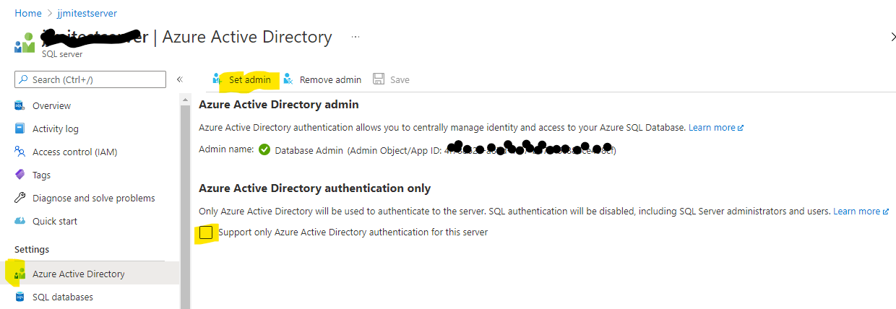

# .NET Core Azure SQL Managed Identity
A sample application demonstrating how to use managed identity with Azure SQL and app services.

There are a number of blogs and documentation pages which discuss the steps on how to get an ASP.NET Core application to authenticate using a managed identity, but none of these has a fully worked sample with all of the source code. So that is what this sample attempts to do.

It builds on the Azure documentation here
[Secure Azure SQL Database connection from App Service using a managed identity](https://docs.microsoft.com/en-us/azure/app-service/app-service-web-tutorial-connect-msi?tabs=windowsclient%2Cdotnetcore#prerequisites)

And other blogs which provide some of the missing pieces. This one here [Connecting with Azure SQL Database using Azure Active Directory and Managed Identity in .NET Core](https://coderjony.com/blogs/connecting-with-azure-sql-database-using-azure-active-directory-and-managed-identity-in-net-core/) is especially useful in showing how to debug using an identity and how to then set the application to pull the managed identity once deployed to an Azure app service.

## So, what problem is this trying to solve?
It may be useful to step back and re-iterate what managed identity is and why it is useful for connecting to and Azure SQL database.

### Managed Identity
This is an identity associated with an Azure service. This capability is usually switched off, but may be enabled. When enabled, for the basic "system" managed identity, and Azure Active Directory application is created and then associated with the Azure service. For web applications hosted in app services, this provides a system identity which may be then used to allow that app service instance to communicate with other Azure AD enabled services. This is essentially a server-to-server relationship that would previously have to be done by registering an Azure AD application and putting its client id and secret in the application settings.

The two main advantages of a managed identity are:
1. There is no client secret to manage and therefore no need for this to be potentially rotated at a later time
2. You do not need to implement code in your application to acquire the identity to use this (or at least this is much streamlined)

[What are managed identities for Azure resources?](https://docs.microsoft.com/en-us/azure/active-directory/managed-identities-azure-resources/overview)

### App Services Managed identity
This may be enabled in the app service instance, which then returns a client ID, which may be used later. When enabled, it creates an Azure AD application which has the same name of the web app. As the web app has to have a unique FQDN, then this means that the name will also be unique in the Azure AD directory.


### Azure SQL Database Active Directory authentication
Azure SQL database can work in SQL authentication mode or Active Directory (AD) Authentication mode. You can also allow both at the same time. When enabling Azure AD authentication, you need to set an AD account as adminstrator of server.



SQL Server Management Studio (SSMS) can authenticate against Azure SQL in Active Directory mode and this is a good way of testing that this works. This can also be a simple route to adding the managed identity user to the database and giving them permission to access resources in the database.

When a web application needs to authenticate against an Azure SQL database, an actual user (user principal) should not be used as even if you know that user's password, the authentication process for users expected these to be entered on Azure AD hosted web pages and there may also be a requirement for multi-factor authentication that cannot be met with a user flow. So a managed identity must use a separate authentication flow - more akin to a device flow.


## The sample app
This sample is a simple web API that returns the contents of the products table from the Azure SQL database sample "NorthWind" database. This is exposed as a GET request on the path /products.

In code terms, the GET method, creates a connection to the SQL database, opens the connection and executes a simple *select Name, ProductNumber from SalesLT.Product* from the Product table in the sample database.

```
// GET: api/<ProductsController>
        [HttpGet]
        public IEnumerable<Product> Get()
        {
            List<Product> products = new List<Product>();
            try
            {
                using (SqlConnection connection = new SqlConnection(Configuration.GetConnectionString("northwind")))
                {
                    connection.AccessToken = new AzureSqlAuthTokenService().GetToken(Configuration["connectionStringForToken"]);
                    connection.Open();
         
                    String sql = "select Name, ProductNumber from SalesLT.Product";
                    using (SqlCommand command = new SqlCommand(sql, connection))
                    {
                        using (SqlDataReader reader = command.ExecuteReader())
                        {
                            while (reader.Read())
                            {
                                products.Add(new Product()
                                {
                                    Name = reader.GetString(0),
                                    ProductNumber = reader.GetString(1)
                                });
                            }
                        }
                    }
                }
            }
            catch (SqlException e)
            {
                _logger.LogError(e.ToString());
            }
            return products;
        }
```
This is almost identical to a conventional application, except for how the application code authenticates to the database. The following line illustrates the change:
```
connection.AccessToken = new AzureSqlAuthTokenService().GetToken(Configuration["connectionStringForToken"]);
```
This is calls down into a simple class which gets a SQL access token using the *current identity*
```
 public class AzureSqlAuthTokenService
    {
        public string GetToken(string connectionString)
        {
            AzureServiceTokenProvider provider = new AzureServiceTokenProvider();
            var token = provider.GetAccessTokenAsync("https://database.windows.net/").Result;
            return token;
        }
    }
```

As can be seen, the application code pulls in a couple of values from configuration. These are important.

```
{
  "Logging": {
    "LogLevel": {
      "Default": "Information",
      "Microsoft": "Warning",
      "Microsoft.Hosting.Lifetime": "Information"
    }
  },
  "AllowedHosts": "*",
  "connectionStringForToken": "RunAs=Developer; DeveloperTool=VisualStudio",
  "ConnectionStrings": {
    "northwind": "Server=tcp:<your-servername>.database.windows.net,1433;Initial Catalog=<your-database>;Persist Security Info=False;"
  }
}

```
Both of these need a little explaining:
1. the database connection string defines the server and database names, but there is no setting for user name, password or how to authenticate.
2. The setting "connectionStringForToken" will have different values in the development environment compared to when deployed in the app service. As can be seen above, these settings are the correct ones for local debugging.

## Local Debugging
One of the challenges with using managed identities and SQL authentication is how for this to both work in the target environment - the target app service, and how to debug locally. In the previous section, it show the value of a setting to be *RunAs=Developer; DeveloperTool=VisualStudio* - this indicates to the code that in development mode, use Visual Studio to authenticate.

How does this work?

You can configure Visual Studio (in this case 2019) to authenticate against Azure AD when debugging. Below is the setting, which can be found in Visual Studio at *Tools -> Options -> Azure Service Authentication*.


This now means that the application when debugging will acquire the identity that is set above and then use this identity to make calls to the SQL databases.

*It should be noted that if the intention is to use this mechanism alongside virtual network (VNet) restrictions, to check the firewall of the SQL Server before debugging sessions to see if this stops the code working in Visual Studio debug mode.*

## Deployment to App Services
In order for the app services code to be able to access via managed identity, a few things need to be set in the app service - besides deploying the code, of course :-)

1. Enable managed identity of the web application
2. Create a user in the target database that corresponds to the above identity - it's name is that of the web app, as previously described.
3. Create a SQL Connections string in *Configuration* - if this is different to that of local debug mode
4. Set an app setting that indicates to the app that it is now not running in Visual Studio. In the case of the sample web app, this is the setting *connectionStringForToken* and this requires a value of *RunAs=App* This is very important.


# Putting it all together
The steps are very much as defined in the documentation [Secure Azure SQL Database connection from App Service using a managed identity](https://docs.microsoft.com/en-us/azure/app-service/app-service-web-tutorial-connect-msi?tabs=windowsclient%2Cdotnetcore#prerequisites)

But to summarise:
1. Clone this GitHub repo for the sample app and get it to build in Visual Studio (2019)
2. Create an Azure AD user that can be used as the administrator for the SQL database. Remember the credentials
3. Use the abov credentials to logon Visual Studio to this account (this is under the tools section). Make sure that this user can authenticate.
4. Create an Azure SQL database (and server) which uses the Northwind sample database.
5. Set the AD administrator for this using the AD user above.
6. Check this using SQL Server Management Studio (SSMS) to logon in Active Directory mode. Keep SSMS open on a new query editor window
7. as the database has now been created, you should be able to run a debug session in Visual Studio and then accessing the /products URL, you should see a list of products.
```
HTTP/1.1 200 OK
Transfer-Encoding: chunked
Content-Type: application/json; charset=utf-8
Server: Microsoft-IIS/10.0
X-Powered-By: ASP.NET
Date: Fri, 15 Oct 2021 09:56:41 GMT
Connection: close

[
  {
    "name": "HL Road Frame - Black, 58",
    "productNumber": "FR-R92B-58"
  },
  {
    "name": "HL Road Frame - Red, 58",
    "productNumber": "FR-R92R-58"
  },
  {
    "name": "Sport-100 Helmet, Red",
    "productNumber": "HL-U509-R"
  },
  
  etc.
```
If not, then recheck before moving on.
9. Create the web app
10. Enable system managed identity
11. Using the name above, create this user in the database using SSMS
```
CREATE USER [<your-app-service-name>] FROM EXTERNAL PROVIDER; 
ALTER ROLE db_datareader ADD MEMBER [<your-app-service-name>]; 
ALTER ROLE db_datawriter ADD MEMBER [<your-app-service-name>]; 
ALTER ROLE db_ddladmin ADD MEMBER [<your-app-service-name>]; 
GO
```
Replacing the placeholder with your app service's name.
12. Go into the *Configuration* section of the app service
13. Add the connection string
14. Add the setting with the *RunAs=App* value
15. From Visual Studio deploy the code to the correct app service (one route is to grab the *publish porfile* and import into the Visual Studio publish wizard).
16. Check the app is working by calling its */products* URL
17. If there are problems re-check and enable app service logging, then check the logs


# Summary

